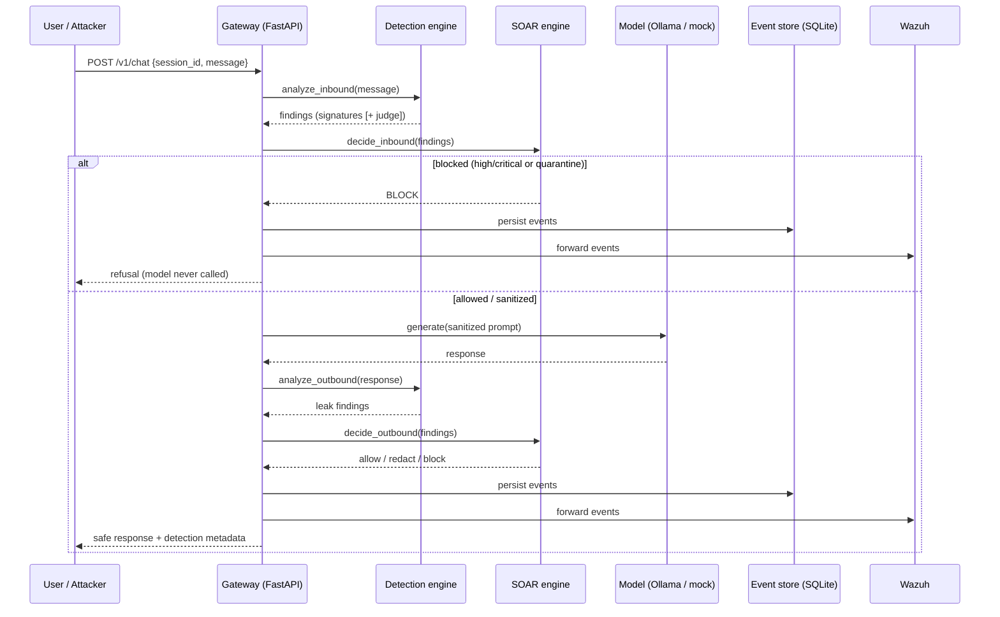

# Architecture

Raqib is a reverse proxy that sits between an LLM application and the model, turns
every prompt/response into a detection opportunity, and emits structured security
events. This document is the data-flow narrative and the component contracts.

## Data flow

## Components & contracts

| Component | File | Contract |
|-----------|------|----------|
| **Gateway** | `gateway/app/main.py` | `POST /v1/chat` orchestrates the lifecycle; read-only `/api/*` serves the dashboard |
| **Config** | `gateway/app/config.py` | All policy (backend, judge mode, block severities, thresholds) from env/.env |
| **Data model** | `gateway/app/models.py` | `Finding` → `SecurityEvent`; enums for Severity / Direction / Verdict |
| **Detection engine** | `gateway/app/detection/engine.py` | `analyze_inbound` / `analyze_outbound` → `DetectionResult` |
| → signatures | `detection/signatures.py` | loads YAML rules, returns `Finding[]` |
| → judge | `detection/llm_judge.py` | Ollama or heuristic → `Finding?` |
| → output inspection | `detection/output_inspect.py` | leak/canary scan + `redact()` |
| **SOAR** | `gateway/app/soar/playbooks.py` | `DetectionResult` → `SoarDecision` (verdict + transformed text) |
| **Event store** | `gateway/app/events/store.py` | persist + `query` / `stats` / `heatmap` aggregations |
| **SIEM forwarder** | `gateway/app/events/siem.py` | JSON-over-UDP to Wazuh; no-op when disabled |
| **Model proxy** | `gateway/app/proxy.py` | `generate(message)` — Ollama with mock fallback |
| **Dashboard** | `dashboard/app.py` | read-only Streamlit client of `/api/*` |
| **Red-team harness** | `redteam/run_harness.py` | drives the gateway, scores detection/FP |

## Trust boundaries

1. **User → Gateway**: everything inbound is untrusted. The gateway is the policy
   enforcement point; the model is never exposed directly.
2. **Gateway → Model**: the model is treated as *vulnerable and fallible* — it may
   comply with injection or leak secrets. Output inspection assumes the model can
   be wrong.
3. **Gateway → SIEM**: one-way event egress; SIEM forwarding can never block or
   break the request path (fail-safe).

## Design principles

- **Fail safe, not open** — judge/SIEM/model failures degrade gracefully; they
  never crash the request or silently disable detection.
- **Config as policy** — response posture is tunable without code changes.
- **Everything is an event** — one normalised, framework-tagged `SecurityEvent`
  for every detection, so the dashboard, the SIEM and the report all read one shape.
- **Measured, not marketed** — see [detection-methodology](detection-methodology.md)
  and the [red-team report](../redteam/reports/detection-report.md).
